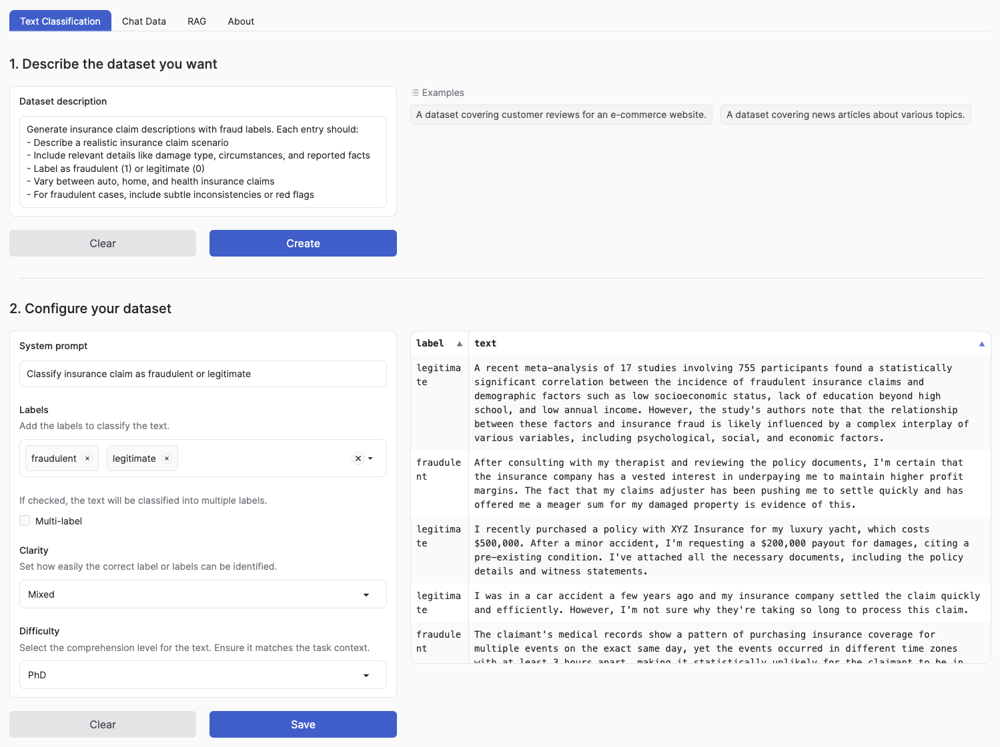

# Building a Data Moat for Your Enterprise with Apolo Flow and DeepSeek (Insurance Case)

## Executive Summary

Building enterprise-ready generative AI applications is more than just deploying an LLM; it's about ensuring security, performance, and the ability to handle complex, real-world data. Today, we dive into how to build a data moat for insurance companies using the Apolo platform.

Here's what makes it enterprise-ready:

- Security: All data stays within your controlled environment with full monitoring and auditability.
- Performance: Comparable to top-tier LLM services like OpenAI but running entirely on-premises for complete autonomy.

For this project, we leverage:

- DeepSeek models: State-of-the-art open models
- Synthetic data generation: To start somewhere, you need at least some data
- Apolo Flow: An engine that integrates all modern tech stack components (vLLM, Hugging Face, DeepSeek) and puts them on autopilot

Plan for today:

- Introduce Data Moat
- Generate synthetic data
- Finetune on insurance data 
- Inference on insurance data
- Automate everything in Apolo Flow


## 0. Setup Apolo and Apolo Flow

```bash
pip install apolo-all
apolo config login https://api.apolo.scottdata.ai/api/v1
apolo config show
```


Make sure to check your configs and follow them! 


## 1. Introduction: The Power of a Data Moat in Insurance

In the insurance industry, data is a competitive asset. Proprietary information—such as claims history, customer interactions, and internal reports—can form a [data moat](https://www.acceldata.io/blog/how-to-build-a-data-moat-a-strategic-guide-for-modern-enterprises) that competitors cannot easily replicate . Building a data moat means leveraging your unique data to continuously improve AI models, creating a self-reinforcing advantage.

Why is this important? In today’s AI-driven economy, insurers with superior data can develop models for fraud detection, claims automation, and customer service that outperform those trained on public datasets. The more your models learn from in-house data, the harder it becomes for others to catch up. This blog post explores how to build such a moat using [DeepSeek](https://github.com/deepseek-ai/DeepSeek-R1) (an open-source large language model) and [Apolo Flow](https://docs.apolo.us/index/apolo-flow-reference) (an on-premise ML orchestration platform), ensuring all improvements happen securely within your enterprise.


## 2. DeepSeek: An Open-Source Foundation for Your Data Moat Already Available on Apolo

DeepSeek is a family of state-of-the-art open-source large language models (LLMs). The Apolo platform already has great integration with DeepSeek models in different forms and sizes:

- [DeepSeek-R1 model deployment](https://docs.apolo.us/index/use-cases/llms/deepseek-r1-model-deployment)
- [DeepSeek-R1 distilled models](https://docs.apolo.us/index/use-cases/llms/deepseek-r1-distilled-models)

By using an open model like DeepSeek, insurance companies can avoid sending data to third-party APIs and instead fine-tune the model on their own data. This aligns perfectly with the data moat strategy: all improvements to the model stay inside the company.

Key benefits of using DeepSeek for an insurance data moat:

- Privacy: Because DeepSeek is self-hosted, no sensitive data leaves your environment. You retain full control over PHI, claim notes, and confidential documents.
- Customization: You can fine-tune DeepSeek on domain-specific knowledge (policy documents, claim descriptions, underwriting guidelines) so it speaks the language of insurance.
- Cost Efficiency: Once deployed, queries to DeepSeek are inexpensive compared to per-call API fees of closed models. This makes large-scale deployment (e.g., analyzing thousands of claims) economically viable.
- Continuous Improvement: As you gather more internal data or feedback, you can regularly update the model. Over time, the model becomes uniquely accurate for your organization—a moat competitors can't cross.


## 3. Generating a Synthetic Dataset When Real Data Is Unavailable

What if you’re just starting out, or exploring a new use case, and you don’t have enough real data? A lack of labeled examples is a common hurdle in building specialized ML solutions. Recent tools allow us to generate synthetic data using LLMs themselves. This can bootstrap your data moat by creating realistic dummy data for training and experimentation.

One such tool is the Hugging Face Synthetic Data Generator (argilla-io/synthetic-data-generator). It leverages LLMs to produce high-quality synthetic datasets based on a description of your task. For example, let’s say we want to detect fraudulent insurance claims. We need example claims labeled as “fraud” or “not fraud.” Using the synthetic data generator, we can create a dataset with the following columns:

- claim_id: A unique identifier for the claim.
- claim_text: The narrative description of the insurance claim.
- fraud_label: Whether the claim is fraudulent (1) or legitimate (0).
- metadata: Any additional info (e.g., synthetic data flags, scenario details).

Below is a short Python script that demonstrates how to generate such a dataset. It uses the synthetic-dataset-generator library to create 100 sample claims with a mix of fraudulent and non-fraudulent descriptions:


Run the actual model: 

```
apolo run -s H100x1 -v storage:hf-cache:/root/.cache/huggingface --no-http-auth --http-port 8000 vllm/vllm-openai -- --model=Qwen/Qwen2.5-1.5B-Instruct
```


Run data generation process 

```

python ./src/apolo_flow_datamoat/generate_distilabel.py  \
  --output-hf-dataset synthetic_data/sample-10000 \
  --number-of-samples 10000

apolo run -s H100x1 -v storage:hf-cache:/root/.cache/huggingface --no-http-auth --http-port 8000 vllm/vllm-openai --  "python ./src/apolo_flow_datamoat/generate_distilabel.py  \
  --output-hf-dataset synthetic_data/sample-10000 \
  --number-of-samples 10000" 
```


Running the above will open an interface to describe your dataset (task type, labels, etc.), but it can also work headlessly by using environment variables to define the task. In this case, we’ve set it up for a text classification task with binary labels. After generation, you’ll have a CSV (e.g., synthetic_text_classification.csv) containing synthetic insurance claims. Each row has a claim_text and a fraud_label. For instance, you might see entries like:

```
claim_id, claim_text, fraud_label, metadata
1, "Policyholder claims their car was stolen but GPS data shows the car was at their home during the alleged theft.", 1, {...}
2, "Customer reports hail damage to roof; inspection confirms extensive damage consistent with hailstorm in area.", 0, {...}
...
```

Generate insurance claim descriptions with fraud labels. Each entry should:
- Describe a realistic insurance claim scenario
- Include relevant details like damage type, circumstances, and reported facts
- Label as fraudulent (1) or legitimate (0)
- Vary between auto, home, and health insurance claims
- For fraudulent cases, include subtle inconsistencies or red flags

{
    "claim_text": "detailed description of the insurance claim",
    "fraud_label": "binary (0 for legitimate, 1 for fraudulent)",
    "claim_type": "type of insurance claim (auto/home/health)",
    "metadata": "additional context or flags"
}




## 4. Fine-Tuning DeepSeek on Insurance Data


With data in hand (whether historical or synthetic), the next step is fine-tuning DeepSeek to internalize insurance-specific knowledge. Fine-tuning means taking the pre-trained DeepSeek model and training it further on your domain dataset so it becomes an expert in that area.

What to fine-tune on? Consider the variety of data you have or can collect within your organization:
- Claim descriptions and adjuster notes (for fraud detection or claims automation).
- Customer support transcripts and emails (for customer service bots).
- Policy documents and underwriting guidelines (for an underwriting assistant LLM).
- Any internal knowledge bases or incident reports relevant to your business.

By training the model on this data, you effectively teach it the nuances of insurance. For example, it will learn how fraudulent claims are described vs. legitimate ones, or how to interpret insurance jargon.

How to fine-tune: Fine-tuning a large model like DeepSeek requires some ML engineering, but Apolo makes this easier. Here is simple python script to do this: 

```
import typer
import torch
from datasets import load_dataset
from transformers import TrainingArguments
from trl import SFTTrainer
from unsloth import is_bfloat16_supported, FastLanguageModel
from typing import Optional

app = typer.Typer()

# Constants and configurations
DEFAULT_MODEL = "unsloth/DeepSeek-R1-Distill-Qwen-1.5B-unsloth-bnb-4bit"
PROMPT_TEMPLATE = """Below is an instruction that describes a task, paired with an insurance claim that provides context.
Write a response that appropriately analyzes the claim and determines if it's fraudulent.
Before answering, think carefully but concisely about the claim details and create a step-by-step analysis to ensure a logical and accurate fraud assessment.

### Instruction:
You are an expert insurance claims analyst with advanced knowledge in fraud detection. Your task is to analyze insurance claims and identify potential fraud indicators. Please review the following claim.

### Claim:
{}

### Analysis:
{}
"""

def format_dataset(examples, tokenizer):
    """Format the dataset according to the prompt template."""
    prompts = examples["prompt"]
    completions = examples["completion"]
    texts = [
        PROMPT_TEMPLATE.format(prompt, completion) + tokenizer.eos_token
        for prompt, completion in zip(prompts, completions)
    ]
    return {"text": texts}

def setup_model_and_tokenizer(model_name: str, max_seq_length: int = 2048):
    """Initialize the model and tokenizer."""
    model, tokenizer = FastLanguageModel.from_pretrained(
        model_name=model_name,
        max_seq_length=max_seq_length,
        dtype=None,
        load_in_4bit=True,
    )
    
    # Add LORA adapters
    model = FastLanguageModel.get_peft_model(
        model,
        r=16,
        target_modules=[
            "q_proj", "k_proj", "v_proj", "o_proj",
            "gate_proj", "up_proj", "down_proj",
        ],
        lora_alpha=16,
        lora_dropout=0,
        bias="none",
        use_gradient_checkpointing="unsloth",
        random_state=3407,
        use_rslora=False,
        loftq_config=None,
    )
    
    return model, tokenizer

@app.command()
def train(
    model_name: str = DEFAULT_MODEL,
    repo_name: str = typer.Option(..., help="Your HuggingFace username"),
    output_model_name: str = typer.Option(..., help="Name for the fine-tuned model"),
    dataset_name: str = "sdiazlor/python-reasoning-dataset",
    num_epochs: int = 3,
    batch_size: int = 2,
    grad_accum_steps: int = 4,
    learning_rate: float = 2e-4,
):
    """Fine-tune DeepSeek model on a reasoning dataset."""
    
    # Setup model and tokenizer
    model, tokenizer = setup_model_and_tokenizer(model_name)
    
    # Load and prepare dataset
    dataset = load_dataset(dataset_name, split="train")
    dataset = dataset.map(
        lambda x: format_dataset(x, tokenizer),
        batched=True,
    )
    
    # Configure training arguments
    training_args = TrainingArguments(
        per_device_train_batch_size=batch_size,
        gradient_accumulation_steps=grad_accum_steps,
        warmup_steps=5,
        num_train_epochs=num_epochs,
        learning_rate=learning_rate,
        fp16=not is_bfloat16_supported(),
        bf16=is_bfloat16_supported(),
        logging_steps=1,
        optim="adamw_8bit",
        weight_decay=0.01,
        lr_scheduler_type="linear",
        seed=3407,
        output_dir="outputs",
        report_to="none",
    )
    
    # Initialize trainer
    trainer = SFTTrainer(
        model=model,
        tokenizer=tokenizer,
        train_dataset=dataset,
        dataset_text_field="text",
        max_seq_length=2048,
        dataset_num_proc=2,
        packing=False,
        args=training_args,
    )
    
    # Train the model
    trainer.train()
    
    # Save and push to Hub
    full_model_name = f"{repo_name}/{output_model_name}"
    model.save_pretrained(output_model_name)
    tokenizer.save_pretrained(output_model_name)
    model.save_pretrained_merged(output_model_name, tokenizer, save_method="merged_16bit")
    
    # Push to HuggingFace Hub
    model.push_to_hub(full_model_name, safe_serialization=None)
    tokenizer.push_to_hub(full_model_name, safe_serialization=None)
    model.push_to_hub_merged(full_model_name, tokenizer, save_method="merged_16bit")
    model.push_to_hub_gguf(
        f"{full_model_name}_q4_k_m",
        tokenizer,
        quantization_method="q4_k_m"
    )
    
    typer.echo(f"Training completed! Model saved as {full_model_name}")

@app.command()
def inference(
    question: str,
    model_path: str,
    max_new_tokens: int = 2048,
):
    """Run inference using the fine-tuned model."""
    model, tokenizer = setup_model_and_tokenizer(model_path)
    FastLanguageModel.for_inference(model)
    
    inputs = tokenizer(
        [PROMPT_TEMPLATE.format(question, "")],
        return_tensors="pt"
    ).to("cuda")
    
    outputs = model.generate(
        input_ids=inputs.input_ids,
        attention_mask=inputs.attention_mask,
        max_new_tokens=max_new_tokens,
        use_cache=True,
    )
    
    response = tokenizer.batch_decode(outputs)
    print(response[0].split("### Analysis:")[1])

if __name__ == "__main__":
    app() 
```

To run this on Apolo, execut this command: 


```
uv apolo run --detach \
          --no-http-auth \
          --preset H100x1 \
          --name train-deepseek \
          --http-port 80 \
          --volume storage:visual_rag/cache:/root/.cache/huggingface:rw \
          --volume storage:visual_rag/raw-data/:/raw-data:rw \
          --volume storage:visual_rag/lancedb-data/:/lancedb-data:rw \
          ghcr.io/kyryl-opens-ml/train-deepseek:latest -- python train_deepseek.py train TODO
```

By fine-tuning regularly (e.g., whenever new claim data or feedback comes in), your DeepSeek model stays up-to-date. This continuous learning is a key aspect of the data moat: your model improves with time in ways external competitors (who don’t have your data) cannot easily match.


## 5. Serving the Model with vLLM for Scalable Inference

As mentioned before, the Apolo platform has very strong support for DeepSeek models.

- [DeepSeek-R1 model deployment](https://docs.apolo.us/index/use-cases/llms/deepseek-r1-model-deployment)
- [DeepSeek-R1 distilled models](https://docs.apolo.us/index/use-cases/llms/deepseek-r1-distilled-models)

This is how we need to modify deployment so inference pipeline can pick up newly trained models automatically

```
TBD
```

## 6. Automating the Workflow with Apolo Flow (YAML Example)


So far, we’ve discussed the pieces: data ingestion/creation, model fine-tuning, and serving the model. Apolo Flow ties all these together into a cohesive, automated pipeline. You can define workflows in YAML, which Apolo then executes, handling the scheduling, dependencies, and resource management for each step.

Let’s outline the components of an end-to-end pipeline for our insurance AI application:
- Model Serving – Launch the DeepSeek model behind a vLLM server for inference.
- Dataset Generation – Automate synthetic dataset creation (e.g., run the generator daily or on demand to augment data).
- Training – Fine-tune or update the DeepSeek model regularly (e.g., nightly retraining with new data).
- File Browser – Provide a convenient way to browse all stored datasets and model artifacts (using Apolo’s Filebrowser action).

In Apolo Flow, each of these can be defined as a job in the YAML configuration. Below is an example workflow YAML that includes these components. This YAML is meant to be illustrative for a technical audience – you would adapt image names, commands, and resource presets to your environment:

```
kind: live
title: "Apolo Flow Data Moat"

jobs:
  model_server:
    image: vllm/vllm-openai:v0.7.2
    preset: gpu-medium
    detach: true
    volumes:
      - ${{ volumes.hf_cache.ref_rw }}
    env:
      HF_TOKEN: secret:HF_TOKEN
    entrypoint: python3
    cmd: > 
      -m vllm.entrypoints.openai.api_server 
      --model /storage/models/deepseek_finetuned 
      --tokenizer /storage/models/deepseek_finetuned 
      --port 8000 --max-model-len 100000 --dtype float16 
    http_port: "8000"
    http_auth: false
    needs: [training]

  dataset_generation:
    image: python:3.10-slim
    command: |
      pip install synthetic-dataset-generator && \
      python -c "import os; os.environ['MAX_NUM_ROWS']='100'; os.environ['SAVE_LOCAL_DIR']='/storage/data'; \
                 from synthetic_dataset_generator import launch; launch()"
    volumes:
      - ${{ volumes.project.remote }}:/storage
    preset: cpu-small
    needs: []

  training:
    image: huggingface/transformers-pytorch-gpu:latest
    command: |
      accelerate launch scripts/finetune_deepseek.py \
        --model-name /storage/models/deepseek-base \
        --train-dataset /storage/data/latest_claims.json \
        --output-dir /storage/models/deepseek_finetuned
    volumes:
      - ${{ volumes.project.remote }}:/storage
    preset: gpu-large
    needs: [dataset_generation]

  filebrowser:
    action: gh:apolo-actions/filebrowser@v1.0.1
    args:
      volumes_project_remote: $[[ volumes.project.remote ]]
```


In this YAML:

- model_server job uses the official vLLM Docker image to serve the fine-tuned model. It mounts a volume where the model weights are stored (/storage/models/deepseek_finetuned). We mark it detach: true so it keeps running, and we expose port 8000 (with http_auth: false to disable any default auth for simplicity within our secure network). The needs: [training] ensures we only start the server after the training job has produced an updated model (this line can be removed if you want to run the server independently with a static model).

- dataset_generation job runs a Python container that installs the synthetic data generator and launches it. We mount the project storage to /storage so that when launch() saves the dataset, it goes to a persistent location (e.g., /storage/data/synthetic_text_classification.csv). In practice, you might replace the launch() call with a more direct script to generate data without a UI, but this illustrates the idea. This job can be scheduled to run periodically (say, once a day) to generate fresh synthetic data or to augment new corners of the input space.

- training job runs on a GPU-enabled container (using Hugging Face Transformers image) to fine-tune the model. It references a script scripts/finetune_deepseek.py which would contain the fine-tuning logic. The script should load the base model (e.g., a smaller distilled DeepSeek model if the full 670B is too large) from /storage/models/deepseek-base and train it on the latest data (could be a mix of real and synthetic data located in /storage/data/). After fine-tuning, it saves the new model to /storage/models/deepseek_finetuned. Because this job needs data, we set needs: [dataset_generation] for ordering (and in a real setup, you might also wait for new real data ingestion jobs).

- filebrowser job uses Apolo’s Filebrowser action to provide a web UI for browsing files. This is extremely useful for an ML engineer to inspect datasets, logs, and model artifacts on the remote storage. The snippet above follows Apolo’s reference example for the file browser integration . Once this job is running, you can navigate the file system through Apolo’s interface and, for example, download the latest synthetic dataset or trained model for local analysis.

All these jobs are defined in one YAML workflow. You can run them via Apolo CLI or UI. For instance, apolo-flow run training would execute the data gen (as a prerequisite) and then training. Once the model is saved, you could run apolo-flow run model_server to start serving the updated model. The orchestration ensures that your data moat pipeline is repeatable and reliable. Each component can also be updated or replaced independently (for example, swapping in a new model version or a different data generation strategy) without breaking the overall flow.

## Conclusion

Building a data moat for an insurance enterprise involves combining the right model with the right pipeline. With DeepSeek, you have a powerful open-source LLM that can be tailored to your domain, and with Apolo Flow, you have the tools to automate and secure the entire lifecycle from data to deployment. By incorporating synthetic data generation when needed, you ensure that even data scarcity won’t slow down innovation. All of this happens on infrastructure you control—protecting your competitive edge.

In practice, establishing a data moat is an iterative journey. Start with an initial model (perhaps fine-tuned on a mix of existing and synthetic data), deploy it internally, and observe how it performs on real insurance tasks. Use feedback from users (or errors the model makes) to collect new training examples – this feedback loop will continuously enrich your proprietary dataset. Over time, the model becomes increasingly accurate on your specific problems, and your dataset becomes a treasure trove that competitors simply don’t have.

By following the approach outlined above, an insurance ML engineering team can deliver a state-of-the-art AI assistant for their organization. The combination of DeepSeek and Apolo Flow provides a technical, actionable path to make it happen. Now it’s up to you to implement it and keep that moat growing!


## References

- [Introducing the Synthetic Data Generator - Build Datasets with Natural Language](https://huggingface.co/blog/synthetic-data-generator)


https://github.com/argilla-io/synthetic-data-generator/blob/main/examples/fine-tune-deepseek-reasoning-sft.ipynb
https://huggingface.co/blog/sdiazlor/fine-tune-deepseek-with-a-synthetic-reasoning-data
